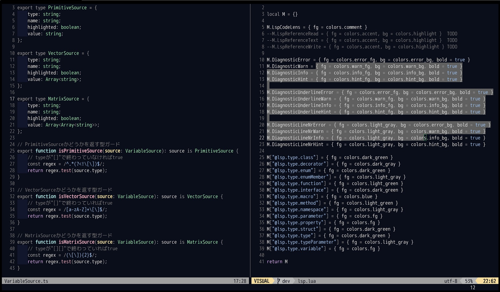

# yash.nvim
A dark Neovim theme with support for LSP and treesitter.



## Requirements
- Neovim 0.8.0 or later
- truecolor terminal support

## Usage
To enable the colorscheme:

```vim
" Vim script
if (has("termguicolors"))
    set termguicolors
endif

colorscheme yash
```

or

```lua
-- lua
if (vim.call("has", "termguicolors")) then
    vim.opt.termguicolors = true
end

vim.cmd("colorscheme yash")
```

## lualine.nvim
To enable yash theme for lualine.nvim: 
```vim
" Vim script
let g:lightline = { 'colorscheme': 'yash' }
```

## lualine.nvim
To enable yash theme for lualine.nvim: 
```lua
-- lua
require("lualine").setup {
    options = {
        -- ...
        theme = "yash"
        -- ...
    }
}
```

## Support
- [LSP Diagnostics](https://neovim.io/doc/user/lsp.html)
- [LSP Semantic Highlight](https://neovim.io/doc/user/lsp.html#lsp-semantic-highlight)
- [defx.nvim](https://github.com/Shougo/defx.nvim)
- [lightline.vim](https://github.com/itchyny/lightline.vim)
- [lualine.nvim](https://github.com/nvim-lualine/lualine.nvim)
- [nvim-cmp](https://github.com/hrsh7th/nvim-cmp)
- [nvim-treesitter](https://github.com/nvim-treesitter/nvim-treesitter)
- [telescope.nvim](https://github.com/nvim-telescope/telescope.nvim)

## Todo
- set unspecified color.
