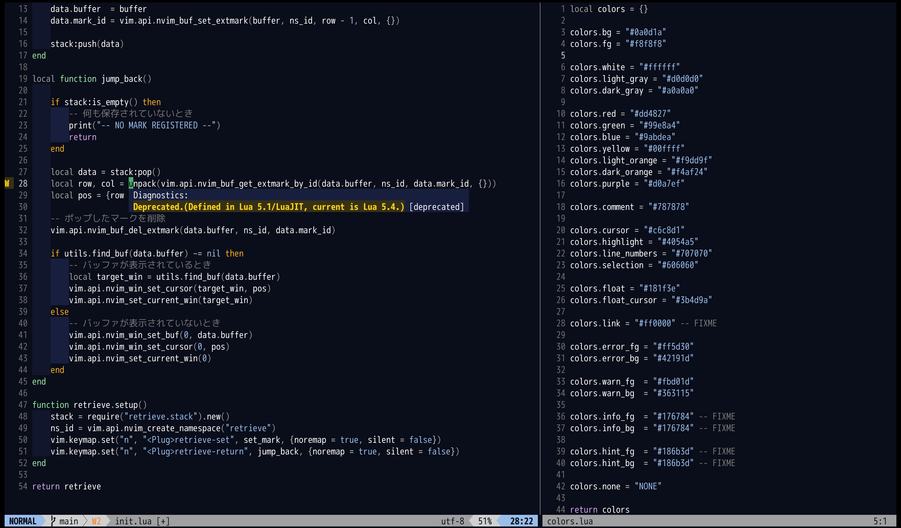

# yash.nvim
A functional color scheme for Neovim.



## Requirements
- Neovim 0.8.0 or later
- truecolor terminal support

## Usage
```vim
if (has("termguicolors"))
    set termguicolors
endif

colorscheme yash
```
or
``lua
if (vim.call("has", "termguicolors")) then
    vim.opt.termguicolors = true
end

vim.cmd("colorscheme yash")
```

## Support
- [LSP Diagnostics](https://neovim.io/doc/user/lsp.html)
- [defx.nvim](https://github.com/Shougo/defx.nvim)
- [lualine.nvim](https://github.com/nvim-lualine/lualine.nvim)
- [nvim-cmp](https://github.com/hrsh7th/nvim-cmp)
- [nvim-treesitter](https://github.com/nvim-treesitter/nvim-treesitter)
- [telescope.nvim](https://github.com/nvim-telescope/telescope.nvim)

## Todo
- set unspecified color.
- lightline support.
