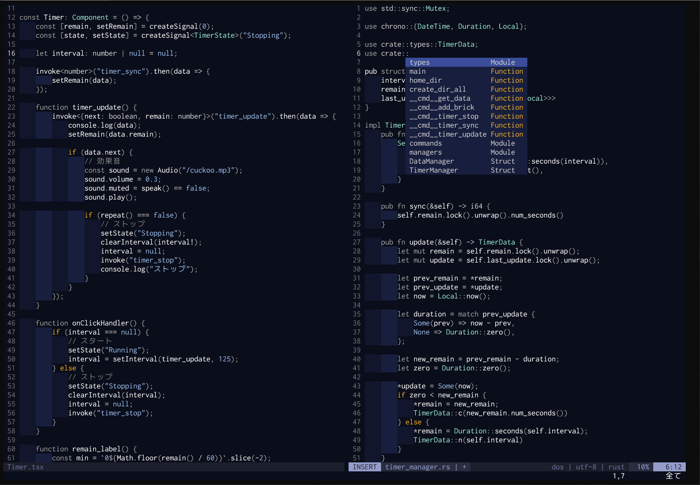

# yash.nvim
A functional color scheme for Neovim.

## Support
- nvim built in lsp
- [treesitter](https://github.com/nvim-treesitter/nvim-treesitter)
- [defx.vim](https://github.com/Shougo/defx.nvim)

## Todo
- set unspecified color.
- lualine/lightline support.
