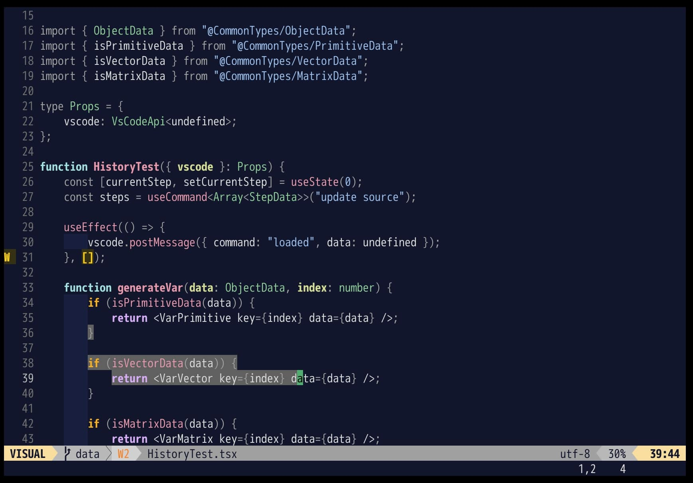

# yash.nvim
A dark Neovim theme with support for LSP and treesitter.



## Features
- Made for readability
- Support for treesitter
- Support for Neovim builtin LSP
- Supports for [a lot of plugins](https://github.com/kihachi2000/yash.nvim#support)

To learn more, see [this page](https://zenn.dev/kihachi2000/articles/4f4314ef791c5d).

## Requirements
- Neovim 0.8.0 or later
- truecolor terminal support

## Installation
Download with your favorite package manager.
```lua
use "kihachi2000/yash.nvim"
```

## Usage
To enable the colorscheme:

```vim
" Vim script
set termguicolors
colorscheme yash
```

or

```lua
-- lua
vim.opt.termguicolors = true
vim.cmd("colorscheme yash")
```

## Support
- [LSP Diagnostics](https://neovim.io/doc/user/lsp.html)
- [LSP Semantic Highlight](https://neovim.io/doc/user/lsp.html#lsp-semantic-highlight)
- [defx.nvim](https://github.com/Shougo/defx.nvim)
- [lightline.vim](https://github.com/itchyny/lightline.vim)
- [lualine.nvim](https://github.com/nvim-lualine/lualine.nvim)
- [nvim-cmp](https://github.com/hrsh7th/nvim-cmp)
- [nvim-treesitter](https://github.com/nvim-treesitter/nvim-treesitter)
- [telescope.nvim](https://github.com/nvim-telescope/telescope.nvim)
- [terminal colors](https://neovim.io/doc/user/nvim_terminal_emulator.html#terminal-config)

### lightline.vim
To enable yash theme for lightline.vim: 
```vim
" Vim script
let g:lightline = { 'colorscheme': 'yash' }
```

or

```lua
-- lua
vim.g.lightline = { colorscheme: "yash" }
```

### lualine.nvim
To enable yash theme for lualine.nvim: 
```lua
-- lua
require("lualine").setup {
    options = {
        theme = "yash"
    }
}
```

## Todo
- set unspecified colors.
